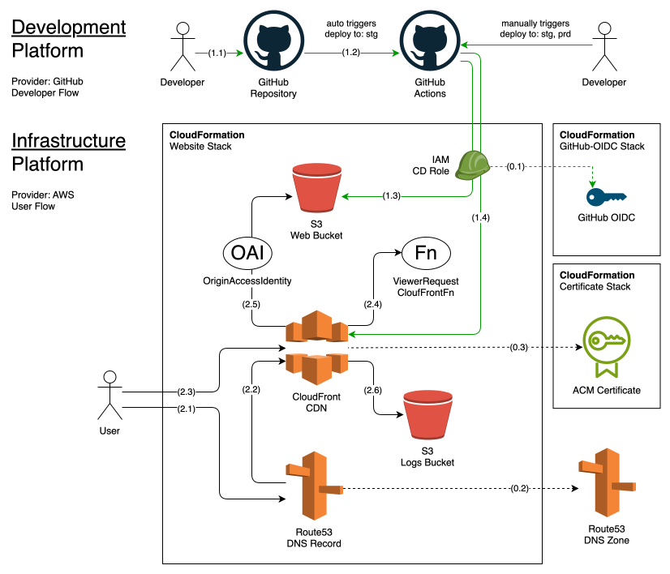

[](https://github.com/new?template_name=tpl-aws-website&template_owner=tsertkov)

# tpl-aws-website

A monorepo template for an AWS-hosted static website, complete with infrastructure code and CI/CD automations, multiple environments, optional basic auth protection.

💲 >= **$0.50** 🌟 Monthly AWS cost (**🌐 DNS Zone** + 🔧 *usage*)

## Table of Contents

- [Infrastructure and Flow Diagram](#infrastructure-and-flow-diagram)
- [Monorepo Layout](#monorepo-layout)
- [Usage](#usage)
- [Setup](#setup)
- [Makefile](#makefile)

## Infrastructure and Flow Diagram

A high-level infrastructure diagram illustrating service integrations and user flows.



Learn more infrastructure details from [the documentation](docs/infrastructure.md).

## Monorepo Layout

- [`fe/`](/fe) - Frontend project
- [`infra/`](/infra) - Infrastructure project
- [`e2etest/`](/e2etest) - End-to-end test project
- [`config.json`](/config.json) - Config file
- [`Makefile`](/Makefile) - Task automations

Learn more about monorepo architecture from [the documentation](docs/monorepo.md).

## Usage

1. [Start new repository](https://github.com/new?template_name=tpl-aws-website&template_owner=tsertkov) from this template.
2. Update config.json as necessary.
3. Go through [Setup](#setup) steps.
4. Edit `fe/src` files, `git add`, `git commit`, `git push`, etc.
5. Vaildate `stg` deployment and run `deploy` workflow for `prd` env.

## Setup

### Deploy infrastructure

Start with deploying AWS shared resources and deploy infrastructure for `stg` and `prd` environments.

```sh
make infra-deploy-certificate
make infra-deploy-github-oidc
make infra-deploy ENV=stg
make infra-deploy ENV=prd
```

Update `s3bucket` and `cloudfrontId` in `config.json` with values returned in stack outputs.

### CI/CD

To enable the deployment workflow, configure the following Environments and Environment Variables in your GitHub repository settings:

- **Environments:**
  - `prd` - Production
  - `stg` - Staging
- **Environment variables:**
  - `AWS_REGION` - AWS region environment is deployed to
  - `AWS_ROLE` - AWS CI/CD Role ARN

Use `CDRoleArn` value from `infra-deploy` outputs to update `AWS_ROLE` environment variable for a corresponding environment in repository settings.

## Makefile

Use `make` to run tasks in this project:

```sh
make
# Available targets:
#   deploy - Build & deploy infrastructure and frontend
#   fe-%   - Frontend (fe) targets
#   infra-% - Infrastructure (infra) targets

make fe
# Available targets:
#   test - test frontend
#   build - build frontend
#   deploy - deploy frontend

make infra
# Available targets:
#   deploy - deploy infrastructure
#   deploy-certificate - deploy ACM certificate
#   deploy-github-oidc - deploy GitHub OIDC
#   test - test infrastructure

make e2etest
# Available targets:
#   run - run e2e tests
#   init - init dependencies
#   init-test - init test dependencies
#   test - run tests
#   npm-run-% - run any npm script
#   npm-% - run any npm command
```
