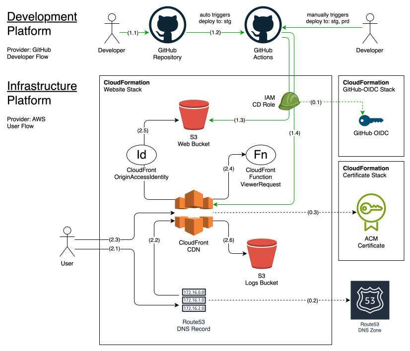

# Infrastructure and Flow Diagram

A high-level infrastructure diagram illustrating service integrations and user flows.

## 1. Developer Flow

1. Developer pushes updates to a GitHub repository.
2. GitHub Actions triggers the `: deploy` workflow when code update conditions are met.
3. GitHub workflow uploads website files to an S3 Web Bucket using the CI/CD Role.
4. GitHub workflow triggers cache invalidation in CloudFront using the CI/CD Role.

## 2. User Flow

1. User requests an IP address for a DNS name.
2. Route53 resolves the IP address from an alias record for the CloudFront distribution.
3. User sends an HTTP request to CloudFront using the resolved IP address.
4. CloudFront calls ViewerRequestFunction handling auth and basic redirects for static site urls.
5. CloudFront forwards request to upstream S3 Web Bucket if requested file is not found in the cache.
6. CloudFront logs request to S3 Logs Bucket.

## 0. Shared Resources

1. IAM OIDCProvider for GitHub.
2. Route53 DNS zone for creating DNS records.
3. ACM certificate for CloudFront.